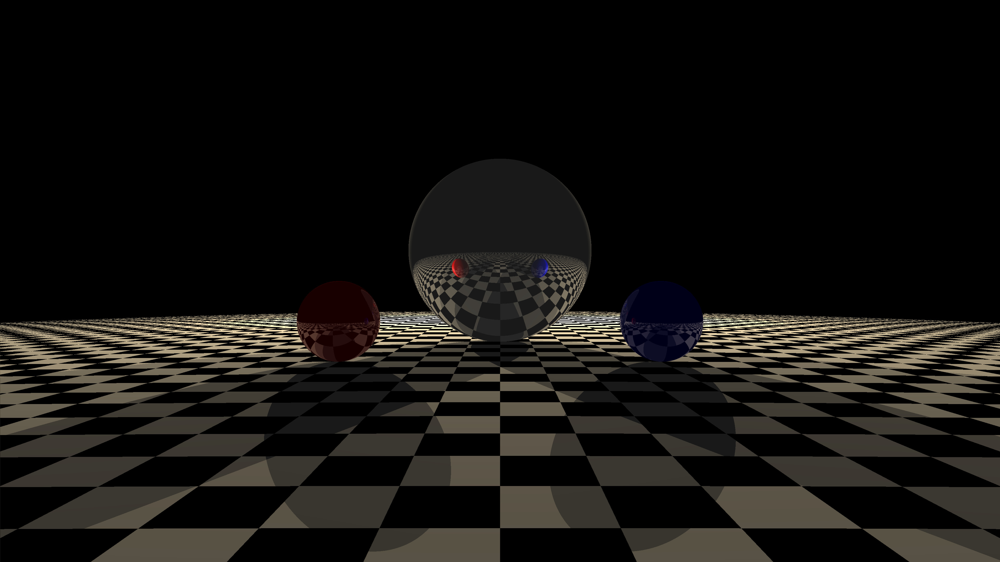
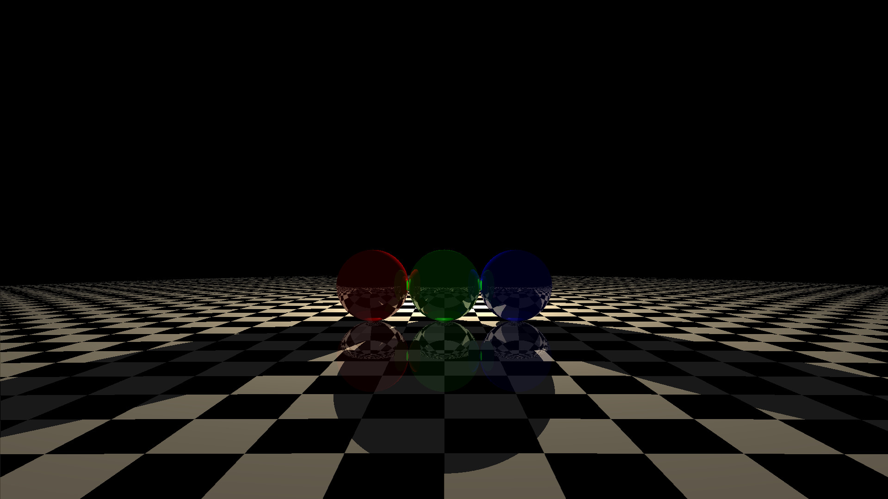
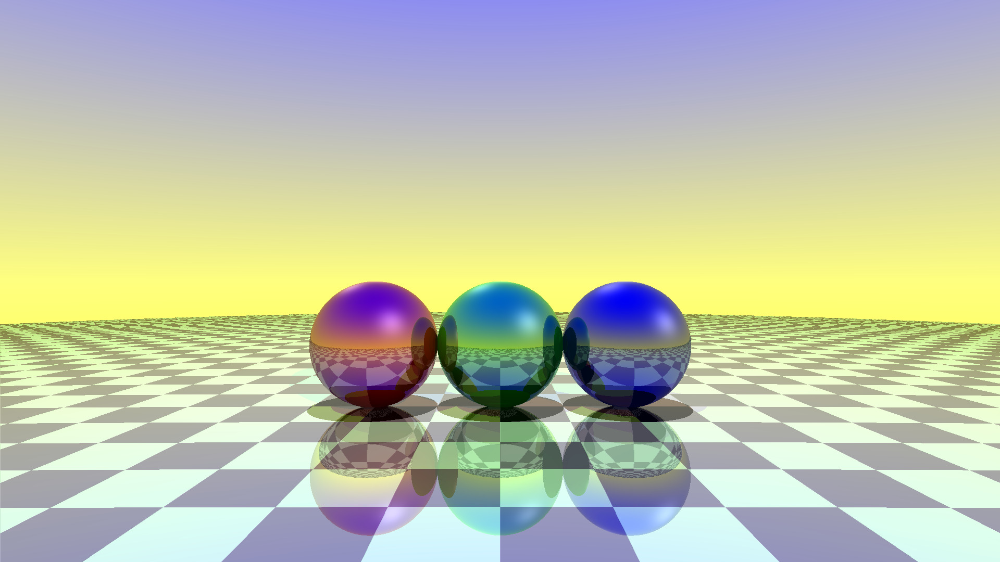
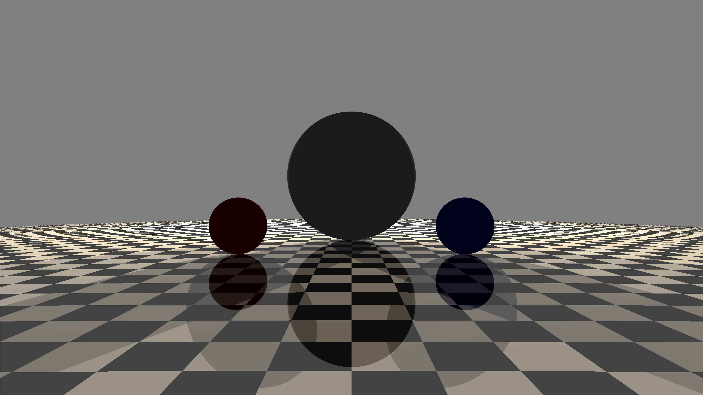

# C-ray-tracer
**este ray tracer é feito puramente em C, fiz este projeto para aprender mais sobre como os ray tracers funcionam.**

aqui estão alguns exemplos de imagens renderizadas por este ray tracer:

<p float="left">
    
    
    
    
</p>

# estrututa do diretório
```
root
├── build                 // diretório de montagem
├── img                   // diretório de imagens
│   ├── render0.jpg
│   ├── render1.jpg
│   └── render2.jpg
├── Makefile
└── src
    ├── libs              // diretório contendo as libs código principal
    │   ├── shapes        // lib de formatos geométricos
    │   │   ├── sphere.c
    │   │   └── sphere.h
    │   ├── vector3.c
    │   └── vector3.h
    └── main.c            // arquivo principal
```

# citações
<ul>
<li><a href="https://medium.com/swlh/a-minimal-raytracer-for-you-to-mess-with-and-learn-from-4502115519cc">A Minimal Raytracer for You to Mess With and Learn From</a></li>
</ul>
